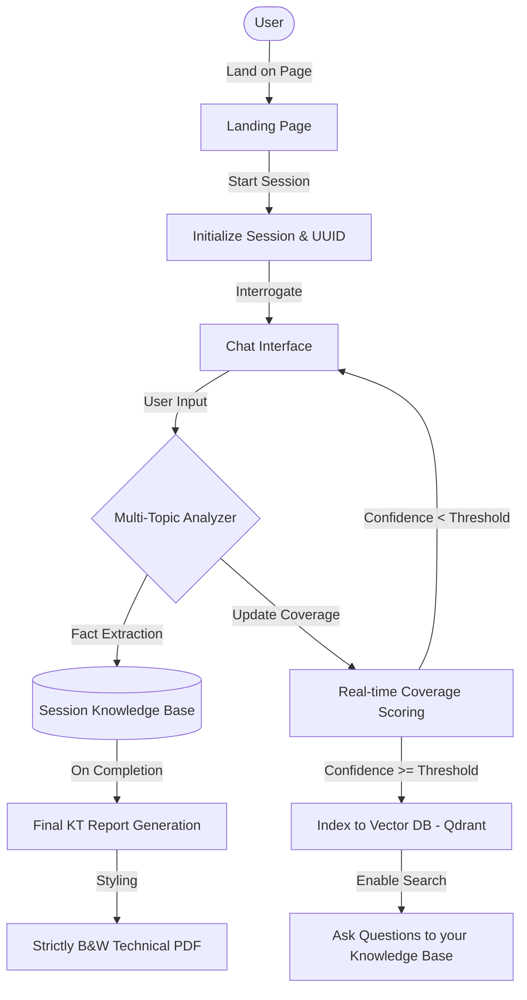

# 🧠 KT Assistant: AI-Powered Knowledge Transfer Engine

**KT Assistant** is an intelligent orchestration engine designed to capture deep technical knowledge and transform it into professional, publication-ready documentation. It doesn't just record what you say—it acts as a **Senior Technical Architect**, actively interviewing you to uncover architectural nuances, operational risks, and hidden system complexities.

---

## 📽️ System Workflow



---

## ✨ Core Pillars

### 🎙️ 1. Active Interrogation Engine
Uses a **Multi-Model Pipeline** (via Gemini 1.5) to drive structured conversations:
- **Fact Extraction**: Automatically parses unstructured chat into high-fidelity JSON schemas.
- **Missing Gap Detection**: Identifies vague explanations and dynamically pivots the conversation to target specific "Missing Sections."
- **Inquisitive Reasoning**: Asks probing questions about error handling, deployment steps, and edge cases.

### 📊 2. Real-Time Coverage Scoring
- **Dynamic Tracking**: Monitors progress across three core pillars:
    - **System Overview**: High-level purpose and core definitions.
    - **Architecture & Data Flow**: Inputs, outputs, and internal mechanics.
    - **Operations & Reliability**: Failure cases, monitoring, and recovery steps.
- **threshold-Based Completion**: Only allows final summary generation once a verified confidence score (e.g., 85%) is met for all topics.

### 🔍 3. Semantic Search (RAG)
- **Live Indexing**: As soon as a topic is "Complete," it is indexed into **Qdrant** with high-dimensional embeddings (3072-dim).
- **Knowledge Retrieval**: Users can search their own interview history using natural language to retrieve specific details instantly.

### 📄 4. Knowledge Upload
- **Bootstrapping**: Don't start from scratch. Upload existing PDF or TXT documentation.
- **Auto-Parsing**: The assistant extracts text and automatically maps it to relevant topics, instantly boosting coverage scores.

### 📄 5. Professional Artifact Generation
- **Strictly B&W PDF**: Generates high-contrast, professional technical documents with:
    - **Markdown Tables** for Data Flow and Input/Output mappings.
    - **Operational Checklists** for SRE/Ops teams.
    - **No-Color Design**: Optimized for printing and professional distribution.

---

## 🛠️ Technology Stack

| Layer | Technology |
| :--- | :--- |
| **Frontend** | Streamlit (Custom Premium CSS & Glassmorphism) |
| **Orchestration** | LiteLLM (Gemini Models) |
| **Database** | Supabase (PostgreSQL) |
| **Vector DB** | Qdrant |
| **PDF Rendering** | Markdown-PDF |
| **Models** | Gemini Models |

---

## 🚀 Getting Started

### 1. Prerequisites
- Python 3.10+
- Poetry
- Qdrant Cluster (Cloud or Local)
- Supabase Account
- Google AI Studio API Key (Gemini)

### 2. Installation
Install the project dependencies using Poetry:
```bash
# 1. Clone the repository
git clone https://github.com/Nikhil-Maheshwari-10/KT-assistant.git
cd KT-assistant

# 2. Install dependencies (creates a virtual environment automatically)
poetry install
```

### 3. Environment Setup
Copy the example environment file and fill in your details:
```bash
cp .env.example .env
```

Your `.env` file should be configured with the following parameters:

| Variable | Description |
| :--- | :--- |
| **SUPABASE_URL** | Your Supabase project URL |
| **SUPABASE_KEY** | Your Supabase service/anon key |
| **QDRANT_URL** | Endpoint for your Qdrant vector database |
| **QDRANT_API_KEY** | API Key for Qdrant authentication |
| **PRIMARY_MODEL_NAME** | Model for core reasoning |
| **SECONDARY_MODEL_NAME** | Model for rapid chat |
| **GEMINI_API_KEY** | Your Google AI Studio API Key |
| **EMBEDDING_MODEL** | Embedding model |
| **KT_CONFIDENCE_THRESHOLD**| Completeness % required before summary/search unlocks |
| **EMBEDDING_DIM** | Dimensions of the embedding vectors |

### 4. Running the Application
You can run the application directly through Poetry:
```bash
poetry run python main.py
```


## 📐 Project Architecture

```text
├── app/
│   ├── core/                   # Config, Logger, and Base Settings
│   ├── models/                 # Pydantic Schemas (Session, Topic, Message)
│   ├── services/               
│   │   ├── ai_engine.py        # Interrogation logic & Summary generation
│   │   ├── db_service.py       # Supabase CRUD operations
│   │   ├── vector_service.py   # Qdrant RAG logic & Expiry cleanup
│   │   └── doc_processor.py    # PDF/TXT extraction for uploads
├── ui/
│   └── streamlit.py            # Streamlit UI & Glassmorphism styling
├── main.py                     # Entry point (Subprocess Orchestrator)
└── requirements.txt
```

---

## 🛡️ Privacy & Maintenance
- **Data TTL**: Sessions have a **6-hour Time-To-Live (TTL)**. The system automatically purges expired records and orphaned vector embeddings.
- **Session Isolation**: Each KT session carries a unique UUID; knowledge is never leaked between sessions.
- **Local Control**: All PDF generation and text processing happens in-memory or in ephemeral storage.

---
*Developed with ❤️ for Technical Documentation Excellence.*
