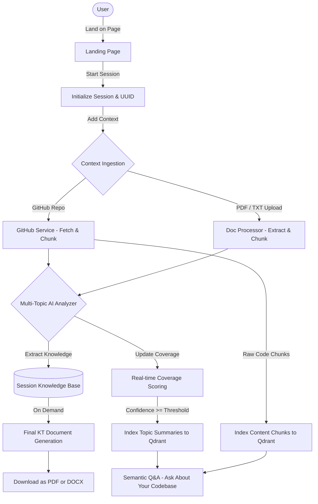

# 🧠 KT Assistant: AI-Powered Knowledge Transfer Engine

**KT Assistant** is an intelligent documentation engine that ingests your GitHub repository or uploaded documents and transforms them into professional, publication-ready knowledge transfer (KT) documents. It analyzes your codebase automatically, tracks coverage across key architectural topics, answers technical questions with RAG-powered semantic search, and exports polished PDF and DOCX reports.

---

## 📽️ System Workflow


```mermaid
graph TD
    User([User]) -->|Land on Page| Landing[Landing Page]
    Landing -->|Start Session| Init[Initialize Session & UUID]
    Init -->|Add Context| Ingest{Context Ingestion}
    Ingest -->|GitHub Repo| GitHub[GitHub Service - Fetch & Chunk]
    Ingest -->|PDF / TXT Upload| DocProc[Doc Processor - Extract & Chunk]
    GitHub --> Analyzer{Multi-Topic AI Analyzer}
    DocProc --> Analyzer
    Analyzer -->|Extract Knowledge| Knowledge[(Session Knowledge Base)]
    Analyzer -->|Update Coverage| Progress[Real-time Coverage Scoring]
    Progress -- Confidence >= Threshold --> Index[Index Topic Summaries to Qdrant]
    GitHub -->|Raw Code Chunks| ChunkIndex[Index Content Chunks to Qdrant]
    Index --> RAG[Semantic Q&A - Ask About Your Codebase]
    ChunkIndex --> RAG
    Knowledge -->|On Demand| Final[Final KT Document Generation]
    Final --> Export[Download as PDF or DOCX]
```

---

## ✨ Core Features

### 🐙 1. GitHub Repository Ingestion
The primary way to feed the assistant. Point it at any public GitHub repository:
- **Branch Selection**: Enter a GitHub URL, click **Load Branches** to fetch all available branches, select your desired branch, then click **Analyse Repository**. Supports both full URLs (`https://github.com/owner/repo`) and shorthand (`owner/repo`).
- **Priority-Based File Fetching**: Fetches up to 200 files in priority order—READMEs and docs first, then configs, then source code. Skips irrelevant files (locks, binaries, node_modules, etc.).
- **Smart Chunking**: File contents are split into overlapping chunks (default 1000 chars, 100 overlap) and stored in Qdrant for RAG-powered Q&A.
- **Budget Limits**: Caps total ingestion at 500 KB of text to keep LLM calls practical and fast.

### 📁 2. Document Upload
Bootstrap from existing documentation without starting from scratch:
- **Supported Formats**: PDF and TXT files.
- **Auto-Processing**: Text is extracted, chunked, indexed into Qdrant, and analyzed against all KT topics automatically.

### 📊 3. Real-Time Coverage Scoring
The AI analyzer tracks knowledge coverage across three core architectural pillars:
- **System Overview**: High-level purpose, core definitions, and scope.
- **Architecture & Data Flow**: Inputs, outputs, internal components, and integration flows.
- **Operations & Reliability**: Failure cases, edge cases, deployment steps, and monitoring.

Each topic gets a confidence score (0–100%). Once a topic hits the configured threshold (default: 80%), its knowledge summary is indexed into Qdrant for semantic retrieval.

### 🔍 4. Intent-Routed Semantic Q&A
Ask anything about your ingested codebase. Questions are automatically classified into intents and routed to the correct data source:

| Intent | Trigger Example | Data Source |
|:---|:---|:---|
| `STRUCTURAL` | "List all files", "What's the folder structure?" | File manifest (exact list) |
| `CONTENT` | "What does main.py do?", "Explain the auth logic" | Qdrant semantic search over code chunks |
| `OPERATIONAL` | "How do I deploy this?", "What env vars are needed?" | Operations & Reliability topic knowledge |
| `BROAD` | "Give me an overview of the architecture" | Full session knowledge base |

### 📄 5. Professional Document Export
Click **Generate Final Document** to produce an exhaustive KT report, then download it in two formats:
- **PDF**: Rendered via headless Chromium (Playwright) with GitHub-style CSS. Mermaid diagrams are rendered as interactive SVGs before PDF capture.
- **DOCX**: Generated via Pandoc with polished table formatting (full-width, even columns, cell borders, and header styling) applied via `python-docx`.

The generated document includes an executive summary, architecture diagrams (Mermaid), data flow sequence diagrams, component breakdowns, dependency tables, environment variable tables, API endpoint tables, failure mode tables, a risk matrix, deployment steps, and an operational checklist.

---

## 🛠️ Technology Stack

| Layer | Technology |
| :--- | :--- |
| **Frontend** | React (Vite) |
| **LLM Orchestration** | LiteLLM (Gemini Models via Google AI Studio) |
| **Session Database** | Supabase (PostgreSQL) |
| **Vector Database** | Qdrant |
| **PDF Rendering** | Playwright (headless Chromium) |
| **DOCX Generation** | Pandoc + python-docx |
| **Embeddings** | FastEmbed (sentence-transformers/all-MiniLM-L6-v2) |
| **GitHub API** | GitHub REST API v3 (public repos) |

---

## 🚀 Getting Started

### 1. Prerequisites
- Python 3.11+
- Qdrant Cluster (Cloud or Local Docker)
- Supabase Account
- Google AI Studio API Key (Gemini)
- Pandoc installed on your system (`brew install pandoc` on macOS)
- *(Optional)* Poetry

### 2. Installation
```bash
# 1. Clone the repository
git clone https://github.com/Nikhil-Maheshwari-10/KT-assistant.git
cd KT-assistant

# 2. Install dependencies (Using standard pip)
python -m venv .venv
source .venv/bin/activate
pip install -r requirements.txt

# OR Install dependencies (Using Poetry - Optional)
poetry install

# 3. Install Playwright browser
playwright install chromium
# If using Poetry: poetry run playwright install chromium
```

### 3. Environment Setup
Copy the example environment file and fill in your details:
```bash
cp .env.example .env
```

Configure your `.env` file with the following parameters:

| Variable | Description |
| :--- | :--- |
| `SUPABASE_URL` | Your Supabase project URL |
| `SUPABASE_KEY` | Your Supabase service/anon key |
| `QDRANT_URL` | Endpoint for your Qdrant cluster |
| `QDRANT_API_KEY` | API Key for Qdrant authentication |
| `QDRANT_COLLECTION` | Name of the Qdrant collection to use |
| `GEMINI_API_KEYS` | Comma-separated Google AI Studio API Keys (supports rotation across multiple keys) |
| `PRIMARY_MODEL_NAME` | Model for ingestion scoring & final KT document generation |
| `SECONDARY_MODEL_NAME` | Model for chat Q&A streaming |
| `TERTIARY_MODEL_NAME` | Model for conversation history summarization & consolidation |
| `EMBEDDING_MODEL` | Local FastEmbed model for generating vector embeddings |

### 4. Supabase Schema
Run the following SQL in your Supabase SQL editor to create the required tables:

```sql
-- Sessions table
CREATE TABLE sessions (
    id UUID PRIMARY KEY,
    overall_confidence INT DEFAULT 0,
    status TEXT DEFAULT 'active',
    topics JSONB,
    file_manifest JSONB DEFAULT '[]'::jsonb,
    updated_at TIMESTAMPTZ DEFAULT NOW()
);

-- Messages table (cascades on session delete)
CREATE TABLE messages (
    id UUID PRIMARY KEY DEFAULT gen_random_uuid(),
    session_id UUID REFERENCES sessions(id) ON DELETE CASCADE,
    role TEXT,
    content TEXT,
    metadata JSONB,
    timestamp TIMESTAMPTZ DEFAULT NOW()
);
```

### 5. Running the Application

There are a few ways to start the application depending on your use case:

#### Option A — FastAPI Backend (REST + SSE API)
```bash
# If using standard pip
python main.py

# If using Poetry
poetry run python main.py
```
The API will be available at:
- **API Base** → `http://localhost:8000`
- **Interactive Docs** → `http://localhost:8000/docs`

Use this when connecting a custom frontend or using the API directly.

#### Option B — React Frontend (Recommended)
```bash
cd fe
npm install
npm run dev
```
The React UI will be available at `http://localhost:5173`. Requires the FastAPI backend (Option A) to be running.

#### Option C — Streamlit UI (Optional / Legacy)
```bash
# If using standard pip
streamlit run ui/streamlit.py

# If using Poetry
poetry run streamlit run ui/streamlit.py
```
The UI will be available at:
- **Streamlit App** → `http://localhost:8501`

> **Note:** The Streamlit UI imports the service layer **directly** (not over HTTP), so it runs **independently** — you do NOT need to start the FastAPI backend to use the Streamlit UI. Run only one at a time, or both in separate terminals if you need the REST API alongside the UI.

#### Dev Mode (hot-reload)
```bash
uvicorn main:app --reload
```

---

## 📐 Project Architecture

```text
├── app/
│   ├── core/
│   │   ├── config.py           # Pydantic settings (reads from .env)
│   │   └── logger.py           # Loguru logger setup
│   ├── models/
│   │   └── schemas.py          # Pydantic schemas: Session, Topic, Message, TopicKnowledge
│   └── services/
│       ├── ai_engine.py        # Intent classification, RAG routing, KT analysis & doc generation
│       ├── db_service.py       # Supabase CRUD (sessions, messages, TTL cleanup)
│       ├── vector_service.py   # Qdrant: upsert/search chunks & summaries, zombie purge
│       ├── github_service.py   # GitHub API ingestion: branch listing, file tree, chunking
│       └── doc_processor.py    # PDF/TXT text extraction for file uploads
├── fe/                         # React/Vite Frontend
│   └── src/                    # Frontend source code
├── scripts/
│   └── generate_pdf.py         # Standalone Playwright PDF renderer (subprocess-safe)
├── ui/
│   └── streamlit.py            # Streamlit UI: chat, sidebar, export (PDF/DOCX)
├── main.py                     # Entry point
├── packages.txt                # System-level apt packages for Streamlit Cloud
└── pyproject.toml              # Poetry dependency manifest
```

---

## 🛡️ Privacy & Maintenance

- **Data TTL**: Sessions have a **6-hour Time-To-Live (TTL)**. On each app startup, the system automatically purges expired Supabase records and their associated orphaned Qdrant vector embeddings ("zombie" cleanup).
- **Session Isolation**: Each KT session carries a unique UUID. Qdrant searches are always scoped by `session_id`—knowledge is never leaked between sessions.
- **Ephemeral Processing**: PDF and DOCX generation happens entirely in temporary files that are deleted immediately after the bytes are read into memory.
- **Cloud Deployment**: A `packages.txt` is included with all required system libraries to run Playwright's headless Chromium on Streamlit Cloud.

---

*Developed with ❤️ for Technical Documentation Excellence.*
